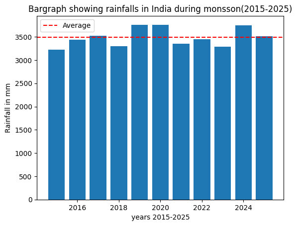

# India Monsoon Rainfall Analysis (2015-2025)

## About
Analysis of 10 years of India's monsoon rainfall patterns 
using ERA5 reanalysis data from Copernicus.

##  Tools & Libraries Used
- Python
- Xarray
- Matplotlib
- NetCDF4

## What I Did
- Downloaded ERA5 climate data from Copernicus
- Loaded & explored NetCDF files using Xarray
- Calculated average monsoon rainfall across India
- Visualized 10 year rainfall trends

## Result

##  Key Insights
- 2019 & 2020 had above average monsoon rainfall
- 2015 & 2018 were below average years
- Average monsoon rainfall ~3500mm across India

## Data Source
ERA5 Monthly Averaged Data from 
Copernicus Climate Data Store
